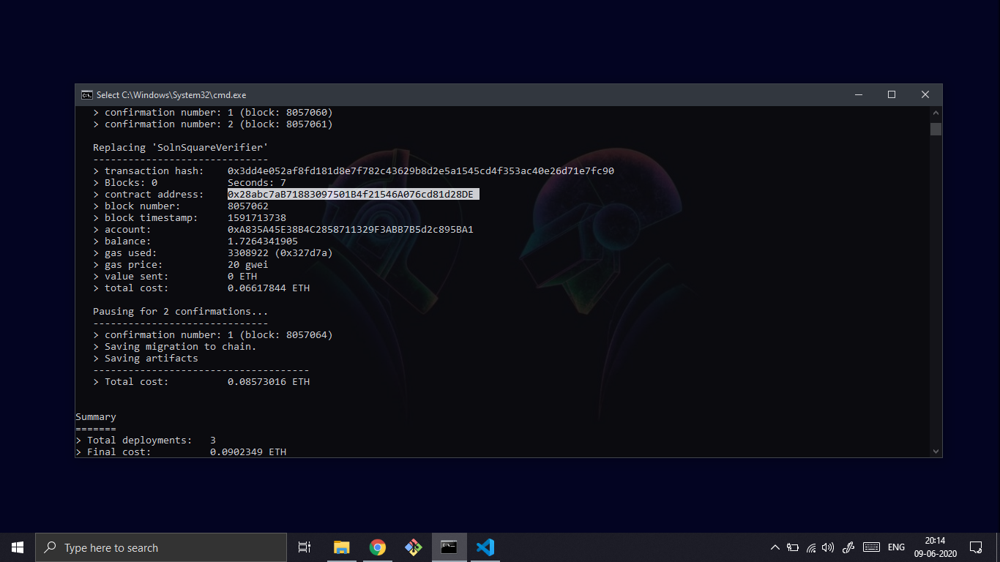

# Udacity Blockchain Capstone (Decentralized Real Estate Marketplace)

- The capstone will build upon the knowledge you have gained in the course in order to build a decentralized housing product. 

- A decentralized house listing service to prevent title issues that could be mitigated by blockchain technology.

## Versions

    truffle: Truffle v5.1.28
    solc: 0.5.16+commit.9c3226ce.Emscripten.clang

## Contracts

### SolnSquareVerifier.sol

<b>Note</b>: SolnSquareVerifier inherits all other contracts except verifier.sol

Completed contract that inherits the ERC721 token backed through zkSnarks that enhances privacy and scalability.

### verifier.sol

Implements Succinct Zero-knowledge proofs (zkSnarks).

### Contract ABI
Can be found on eth-contracts/build/contracts Folder 

---

## Quick Start Deploying to Ganache and Testing

1. cd into project repro & install modules

        cd RealEstateMarketplace

        npm install

2. Compile Contracts

        truffle compile

            

1. Start ganache (CLI or GUI)

        ganache-cli

2. Mirgrate locally

        truffle migrate --network development --reset
    
            

#### Testing contracts

Testing ERC721

File: TestERC721Mintable.js

Test minting functionality of tokens and transfer of tokens.

    truffle test ./test/TestERC721Mintable.js

        

Test zkSnarks

File: TestSquareVerifier.js

Verifies zkSnarks is successfully implemented.

    truffle test ./test/TestSquareVerifier.js

        

Testing ERC721 token with zkSnarks

File: TestSolnSquareVerifier.js

Test minting with zkSnarks.

    truffle test ./test/TestSolnSquareVerifier.js

        
---

## Quick Start Deploying to ropsten

1. Make a new project with Infura

    Infura: https://infura.io

2. Setup truffle-config

    2.1 set infuraKey 

    2.2 set mnemonic from metamask within HDWalletProvider

    2.3 set ropsten endpoint within HDWalletProvider 

3. Migrate to ropsten

    `truffle migrate --network ropsten`

       

1. Finding ER721 token on ether-scan

    https://ropsten.etherscan.io/address/0x28abc7aB71883097501B4f21546A076cd81d28DE

2. Minting tokens

    https://www.myetherwallet.com/interface/interact-with-contract

3. Minted 10 tokens
   
    https://ropsten.etherscan.io/tx/0xcf6cb223814857f666f925d23d78adbf47e80f0039ca5379ef00d330c5984b26

    https://ropsten.etherscan.io/tx/0xb6c312b251b33cedadfd81e37fe5c2ee46222ca15494cf296ae33f187c6a3708

    https://ropsten.etherscan.io/tx/0x0f20955b08dd9506ea5b524b7b0427df1695fb7122bf48bd3f49eed10ca5ef31

    https://ropsten.etherscan.io/tx/0x13a25d72f95feea77f6fc81963e7f9338b11c9d2b4f03e5015e524f64d23bc04

    https://ropsten.etherscan.io/tx/0x3cf65045fb4ed3a59f1a9de32412fbbb5bc29bf46b7a1f8992ec0305697045aa

    https://ropsten.etherscan.io/tx/0x09bb29e091ece35c6bc0c1ee7ace43fb2d7bfb719ca037b559ddc11bee6b0a12

    https://ropsten.etherscan.io/tx/0x786646fc66d488c4674b63401c74f9e92a258fcde6dccf6d40ec9ce5fe2979a0

    https://ropsten.etherscan.io/tx/0xcc38cf06ca4443a648bf65c921c929c1dc4e293d5f23fc30552fbf3ad315c8b6

    https://ropsten.etherscan.io/tx/0xc899b033bb25425c53f6e220c27572310d66bddc816ce62e53018c05d0ad1d25

    https://ropsten.etherscan.io/tx/0xf6d85e381c80c4e1f9d1eed5f1d4ab4db7cc39bc3101475cbd68b4348b6536ac

# Project Resources

* [Remix - Solidity IDE](https://remix.ethereum.org/)
* [Visual Studio Code](https://code.visualstudio.com/)
* [Truffle Framework](https://truffleframework.com/)
* [Ganache - One Click Blockchain](https://truffleframework.com/ganache)
* [Open Zeppelin ](https://openzeppelin.org/)
* [Interactive zero knowledge 3-colorability demonstration](http://web.mit.edu/~ezyang/Public/graph/svg.html)
* [Docker](https://docs.docker.com/install/)
* [ZoKrates](https://github.com/Zokrates/ZoKrates)
